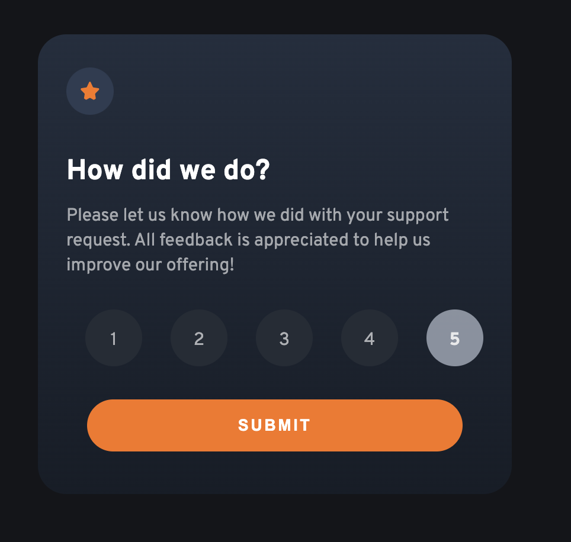
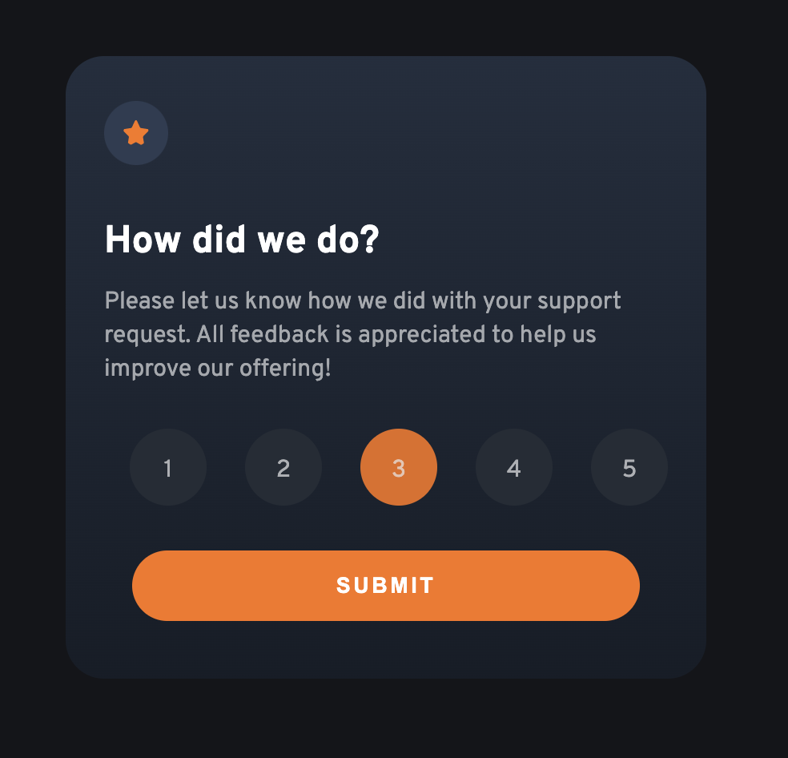

# Frontend Mentor - Interactive rating component solution

This is a solution to the [Interactive rating component challenge on Frontend Mentor](https://www.frontendmentor.io/challenges/interactive-rating-component-koxpeBUmI).

## Table of contents

- [The goal](#the-goal)
- [Screenshots](#screenshots)
- [Links](#links)
- [My process](#my-process)
- [Built with](#built-with)

## The goal

Users should be able to:

- Have the layout respond to their device's screen size
- See hover states for all interactive elements
- Select and submit a number rating
- See the "Thank you" card state after submitting a rating

## Screenshots

**Initial + Hover state**

**Rating selected**

**Thank you!**

## Links

- [GitHub repo](https://github.com/dominicva/rating-component)
- [See it deployed here](https://rating-component-omega.vercel.app/)

## Built with

- Vanilla HTML & CSS... memories of simpler times 😂
- Vanilla JS DOM mutation / mutilation. Was a good reminder that React is quite helpful.
